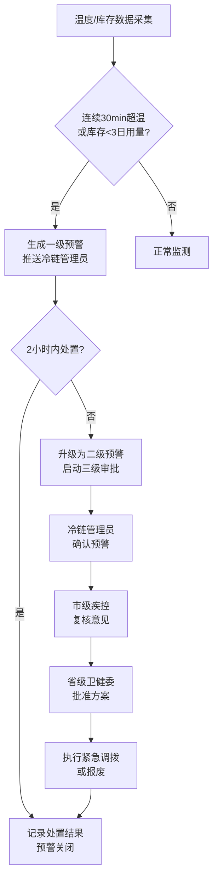

## 1. 产品概述

全国性疫苗冷链与免疫规划智能监测分析平台，实时接入各级疾控中心冷库温度、运输车辆GPS轨迹、接种点库存及接种记录数据，提供全流程智能监测、预警处置、预测调拨、统计报表等核心能力，保障疫苗从生产到接种的全程质量安全。

- 核心价值：解决疫苗冷链断链、库存短缺、接种不及时等风险问题，实现全国免疫规划数字化、智能化管理
- 目标用户：国家/省/市三级疾控中心管理员、冷链管理员、接种点工作人员、卫健委审批人员

## 2. 核心功能

### 2.1 用户角色

| 角色 | 登录方式 | 核心权限 |
|------|----------|----------|
| 国家级管理员 | 账号密码 | 查看全国数据、审批二级预警、生成全国报表 |
| 省级管理员 | 账号密码 | 查看本省数据、审批调拨申请、生成省级报表 |
| 市级管理员 | 账号密码 | 查看本市数据、复核预警、生成市级报表 |
| 冷链管理员 | 账号密码 | 处置预警、维护冷链设备、查看温度曲线 |
| 接种点人员 | 账号密码 | 录入库存、登记接种、查看接种统计 |

### 2.2 功能模块

1. **登录页**：三级权限登录、验证码校验
2. **核心看板**：全国冷链运行热力图、接种覆盖率排名、KPI指标卡、省份下钻
3. **冷链监测**：冷库温度实时监测、运输车辆GPS轨迹、冷链设备状态、温度曲线
4. **库存管理**：疫苗批次库存、库存周转、库存预警、出入库记录
5. **接种管理**：接种记录、接种及时率、人群年龄分布、接种进度
6. **预警中心**：一级/二级预警列表、预警处置、三级审批流程（管理员确认→市级复核→省级批准）
7. **免疫规划**：年度接种计划Excel上传、月度目标提取、90天缺口预测、采购批次推荐、区域调拨方案
8. **统计报表**：冷链健康诊断周报、温度超标率同比环比、疫苗损耗率排名、接种进度对比
9. **系统设置**：用户管理、权限分配、阈值配置、字典维护

### 2.3 页面详情

| 页面名称 | 模块名称 | 功能描述 |
|----------|----------|----------|
| 登录页 | 登录表单 | 账号密码登录、三级权限选择、图形验证码、登录状态记忆 |
| 核心看板 | KPI指标卡 | 冷链温度合格率、库存周转天数、接种及时率、冷链设备故障率，带同比环比 |
| 核心看板 | 省份筛选 | 下拉选择省份/全国切换，疫苗类型多选 |
| 核心看板 | 全国热力图 | 各省冷链运行状态热力渲染，颜色深度对应合格率，点击省份下钻 |
| 核心看板 | 接种覆盖率排名 | 横向条形图，各省接种率降序排列，可切换疫苗类型 |
| 核心看板 | 省份下钻弹窗 | 近7天温度曲线图（多冷库叠加）、接种人群年龄分布饼图 |
| 冷链监测 | 冷库列表 | 分页表格，显示冷库名称、所属省份、当前温度、状态、连续运行时长 |
| 冷链监测 | 温度曲线 | 支持选择多个冷库、时间段，折线图展示温度变化与阈值线 |
| 冷链监测 | 车辆轨迹 | 地图展示运输车辆位置、轨迹回放、温度实时显示 |
| 冷链监测 | 设备列表 | 冷链设备运行状态、故障记录、维护周期 |
| 库存管理 | 批次库存表 | 疫苗名称、批次号、省份、数量、有效期、周转天数、3日用量 |
| 库存管理 | 库存预警 | 低于3日用量高亮、快速调拨入口 |
| 库存管理 | 出入库记录 | 时间线形式展示所有出入库操作 |
| 接种管理 | 接种记录表 | 分页表格，含接种人、疫苗、批次、接种点、时间、是否及时 |
| 接种管理 | 接种及时率 | 按疫苗/省份统计，仪表盘展示 |
| 接种管理 | 年龄分布 | 饼图展示0-6岁、7-17岁、18-59岁、60岁+分布 |
| 预警中心 | 预警列表 | 一级/二级标签切换，按时间/级别/状态筛选，红色/橙色高亮 |
| 预警中心 | 预警详情 | 触发时间、温度/库存数据、处置记录、审批流程状态 |
| 预警中心 | 三级审批流 | 待办审批列表、逐级审批、审批意见填写、紧急调拨/报废选择 |
| 免疫规划 | 计划上传 | Excel拖拽上传、模板下载、数据预览与校验 |
| 免疫规划 | 月度目标 | 提取后的各月接种目标表格、可编辑调整 |
| 免疫规划 | 缺口预测 | 未来90天每日缺口预测曲线、缺口汇总表 |
| 免疫规划 | 调拨方案 | AI推荐最优采购批次、区域调拨路线、成本估算 |
| 统计报表 | 周报列表 | 按周生成冷链健康诊断报告，PDF下载 |
| 统计报表 | 报告详情 | 温度超标率同比环比柱状图、疫苗损耗率排名、接种进度对比雷达图 |
| 统计报表 | 策略推荐 | 基于上周趋势的冷链维护策略和接种活动安排建议 |
| 系统设置 | 用户管理 | 用户增删改、角色分配、所属区域设置 |
| 系统设置 | 阈值配置 | 温度上下限、连续超标时长、库存安全天数等参数 |
| 系统设置 | 字典维护 | 疫苗种类、省份地市、设备类型等基础数据 |

## 3. 核心流程

### 3.1 预警处置流程

用户登录后进入预警中心，查看一级预警（冷库连续30分钟超温或库存低于3日用量），冷链管理员在2小时内完成处置并填写处置记录。若超时未处置，系统自动升级为二级预警，启动三级审批：冷链管理员确认→市级疾控复核→省级卫健委批准，最终执行紧急调拨或报废流程。

### 3.2 免疫规划预测流程

管理员上传年度接种计划Excel，系统自动提取各月接种目标，结合历史接种数据与损耗率，预测未来90天每日疫苗需求量，对比当前库存计算缺口，AI推荐最优采购批次与区域调拨方案。

## 4. 用户界面设计

### 4.1 设计风格

- **主色调**：医疗科技蓝（#1890FF），辅以专业绿（#52C41A）表示正常，警示橙（#FAAD14）表示预警，危险红（#F5222D）表示超标
- **背景**：深色科技主题（#0A1628），配以渐变色信息面板和微发光边框，体现"智能监测"的科技感
- **按钮风格**：圆角4px，渐变填充，悬停时阴影加深 + 微上浮动效
- **字体**：标题使用 Rajdhani（科技感等宽数字），正文使用 Source Han Sans CN（思源黑体）
- **布局风格**：卡片式布局 + 网格信息面板 + 左侧导航栏 + 顶部状态栏，大屏数据看板风格
- **图标风格**：线性 Lucide 图标，主色填充，状态色（绿/橙/红）指示运行状态

### 4.2 页面设计概览

| 页面名称 | 模块名称 | UI元素 |
|----------|----------|--------|
| 核心看板 | KPI指标卡 | 渐变背景、发光边框、大号数字动画、同比百分比箭头 |
| 核心看板 | 全国热力图 | SVG中国地图、省份渐变色填充、tooltip悬浮、点击下钻动效 |
| 核心看板 | 排名条形图 | 横向条形带省份标签、进度条渐变、hover高亮 |
| 冷链监测 | 温度曲线 | 双Y轴折线、阈值线虚线、超标区域红色渐变填充 |
| 预警中心 | 预警卡片 | 状态色左边框、脉冲动画、时间线审批节点 |
| 免疫规划 | 预测曲线 | 阴影区域表示置信区间、不同疫苗类型多色叠加 |
| 统计报表 | 报告卡片 | 仿纸张质感、分块段落、数据高亮标签 |

### 4.3 响应式

- 采用 Desktop-first 设计，主适配分辨率 1920×1080
- 侧边栏可折叠，适配 1366×768 等小屏
- 表格支持横向滚动，图表容器自适应宽度
- 关键数据看板页在 4K 屏优化布局密度

### 4.4 视觉特效

- 页面加载：卡片逐级淡入上移（stagger 动画）
- KPI数字：滚动递增动效（countUp）
- 热力图省份：hover 时放大 + 发光边框
- 预警卡片：新预警进场滑入 + 警示色脉冲呼吸
- 温度曲线：数据点 hover 时放大并展示 tooltip
- 整体背景：深蓝色渐变 + 极淡科技网格纹理
