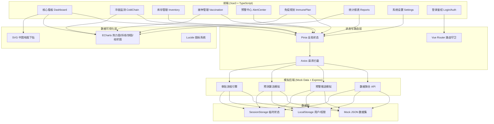

## 1. 架构设计



## 2. 技术选型说明

- **前端框架**：Vue 3.4 + TypeScript 5.2 + Vite 5.1
  - Vue 3 Composition API 便于复杂逻辑抽离为 composables
  - TypeScript 严格模式保障接口/类型安全
  - Vite 极速热更新与构建
- **UI 样式**：Tailwind CSS 3.4 + 自定义 CSS 变量主题（深蓝科技风）
- **状态管理**：Pinia 2.1（替代 Vuex，更轻量 + TS 友好）
- **路由**：Vue Router 4.3 + 路由元信息实现三级权限拦截
- **HTTP 请求**：Axios 1.6 + 自定义请求/响应拦截器（鉴权 token、错误统一处理）
- **数据可视化**：ECharts 5.5（热力图、折线、饼图、雷达、仪表盘等）
- **图标**：Lucide Vue Next 0.345
- **后端（可选，纯前端 mock 优先）**：Express 4.18 + TypeScript，用于模拟真实 API 响应
- **Mock 数据**：项目内独立 mock 目录，使用 Mock.js/自写函数生成符合业务语义的模拟数据
- **工具库**：dayjs（日期）、xlsx（Excel 上传解析）、countup.js（KPI 数字滚动）

## 3. 路由定义

| 路由路径 | 页面组件 | 权限等级 | 说明 |
|----------|----------|----------|------|
| `/login` | Login.vue | 公开 | 登录页，三级权限选择 + 验证码 |
| `/dashboard` | Dashboard.vue | 全部 | 核心看板：KPI + 热力图 + 排名 |
| `/coldchain` | ColdChain.vue | 全部 | 冷链监测：冷库列表 + 温度曲线 + 车辆 |
| `/coldchain/equipment` | Equipment.vue | 冷链/管理员 | 冷链设备管理 |
| `/inventory` | Inventory.vue | 全部 | 库存管理：批次库存 + 出入库 |
| `/vaccination` | Vaccination.vue | 全部 | 接种管理：记录 + 及时率 + 年龄分布 |
| `/alerts` | Alerts.vue | 全部 | 预警中心：一级/二级预警 + 处置 |
| `/alerts/approval` | Approval.vue | 市/省/国家 | 三级审批流程工作台 |
| `/plan` | Plan.vue | 省/国家 | 免疫规划：上传 + 月度目标 |
| `/plan/forecast` | Forecast.vue | 省/国家 | 90天缺口预测 + 调拨方案 |
| `/reports` | Reports.vue | 全部 | 统计报表：周报列表 + 查看 |
| `/settings` | Settings.vue | 国家/省 | 系统设置：用户 + 阈值 + 字典 |
| `/403` | Forbidden.vue | 公开 | 无权限页 |
| `*` | NotFound.vue | 公开 | 404页 |

路由守卫逻辑：未登录 → `/login`；登录后根据用户角色 level（1国家/2省/3市）与路由 meta.level 匹配，不足则跳转 `/403`。

## 4. 目录结构

```
493/
├── public/
│   └── favicon.ico
├── src/
│   ├── assets/                  # 静态资源
│   │   ├── styles/
│   │   │   ├── index.css        # Tailwind + 全局样式
│   │   │   ├── theme.css        # CSS 变量：颜色/字体/阴影
│   │   │   └── animations.css   # 全局动画 keyframes
│   │   └── fonts/               # Rajdhani / 思源黑体
│   ├── components/              # 通用可复用组件
│   │   ├── layout/
│   │   │   ├── Sidebar.vue      # 侧边导航（可折叠）
│   │   │   ├── Topbar.vue       # 顶部状态栏 + 用户菜单
│   │   │   └── AppLayout.vue    # 主布局容器
│   │   ├── charts/
│   │   │   ├── HeatmapChina.vue # 全国热力图
│   │   │   ├── LineChart.vue    # 通用折线图
│   │   │   ├── BarRank.vue      # 排名条形图
│   │   │   ├── PieChart.vue     # 饼图/环形图
│   │   │   ├── RadarChart.vue   # 雷达图
│   │   │   └── GaugeChart.vue   # 仪表盘
│   │   ├── KpiCard.vue          # KPI 指标卡（发光边框 + 数字滚动）
│   │   ├── DataTable.vue        # 通用分页表格
│   │   ├── AlertCard.vue        # 预警卡片
│   │   ├── ApprovalTimeline.vue # 审批时间线
│   │   ├── Modal.vue            # 通用弹窗
│   │   └── EmptyState.vue       # 空状态
│   ├── composables/             # Vue 组合式函数
│   │   ├── useAuth.ts           # 登录/权限/用户信息
│   │   ├── usePermission.ts     # 权限判断辅助
│   │   ├── useColdChain.ts      # 冷链数据查询
│   │   ├── useAlerts.ts         # 预警订阅/处置
│   │   └── useAreaFilter.ts     # 省份/疫苗筛选联动
│   ├── pages/                   # 页面级组件
│   │   ├── Login.vue
│   │   ├── Dashboard.vue
│   │   ├── ColdChain.vue
│   │   ├── Equipment.vue
│   │   ├── Inventory.vue
│   │   ├── Vaccination.vue
│   │   ├── Alerts.vue
│   │   ├── Approval.vue
│   │   ├── Plan.vue
│   │   ├── Forecast.vue
│   │   ├── Reports.vue
│   │   ├── Settings.vue
│   │   ├── Forbidden.vue
│   │   └── NotFound.vue
│   ├── router/
│   │   └── index.ts             # 路由表 + 守卫
│   ├── stores/                  # Pinia stores
│   │   ├── user.ts              # 用户/权限/登录态
│   │   ├── dashboard.ts         # 看板筛选状态
│   │   ├── alerts.ts            # 预警列表与待办
│   │   └── ui.ts                # 全局 UI 状态（折叠、主题等）
│   ├── api/                     # 接口请求封装
│   │   ├── request.ts           # Axios 实例 + 拦截器
│   │   ├── auth.ts
│   │   ├── dashboard.ts
│   │   ├── coldchain.ts
│   │   ├── inventory.ts
│   │   ├── vaccination.ts
│   │   ├── alerts.ts
│   │   ├── plan.ts
│   │   └── reports.ts
│   ├── mock/                    # 模拟数据与 mock 拦截
│   │   ├── index.ts             # 注册所有 mock 接口
│   │   ├── auth.mock.ts
│   │   ├── dashboard.mock.ts
│   │   ├── coldchain.mock.ts
│   │   ├── inventory.mock.ts
│   │   ├── vaccination.mock.ts
│   │   ├── alerts.mock.ts
│   │   ├── plan.mock.ts
│   │   └── reports.mock.ts
│   ├── types/                   # TS 类型定义
│   │   ├── index.ts             # 全局业务类型
│   │   └── api.ts               # 请求响应类型
│   ├── utils/                   # 工具函数
│   │   ├── number.ts            # 千分位/百分比/数字滚动
│   │   ├── date.ts              # dayjs 封装
│   │   ├── excel.ts             # xlsx 解析
│   │   ├── storage.ts           # LocalStorage 封装
│   │   └── validate.ts          # 表单校验
│   ├── App.vue
│   └── main.ts
├── index.html
├── package.json
├── tsconfig.json
├── vite.config.ts               # @ 别名配置、代理
├── tailwind.config.js
└── postcss.config.js
```

## 5. 核心类型定义 (TypeScript)

```typescript
// 用户与权限
type UserLevel = 1 | 2 | 3; // 1-国家 2-省 3-市
interface UserInfo {
  id: string;
  username: string;
  realName: string;
  level: UserLevel;
  role: 'NATIONAL' | 'PROVINCE' | 'CITY' | 'COLD_CHAIN' | 'VACCINE_POINT';
  province?: string;
  city?: string;
  permissions: string[];
  avatar?: string;
}

// 区域
interface AreaNode {
  code: string;
  name: string;
  children?: AreaNode[];
}

// KPI 指标
interface KpiData {
  label: string;
  value: number;
  unit: string;
  trend: number;      // 同比百分比
  status: 'up' | 'down' | 'flat';
  healthy: boolean;   // 是否在健康范围
}

// 省份冷链数据
interface ProvinceColdData {
  code: string;
  name: string;
  temperatureRate: number;  // 温度合格率 0-100
  coverageRate: number;     // 接种覆盖率
  alertCount: number;
  totalColdStores: number;
}

// 冷库
interface ColdStore {
  id: string;
  name: string;
  province: string;
  city: string;
  address: string;
  currentTemp: number;
  targetTempMin: number;
  targetTempMax: number;
  status: 'NORMAL' | 'WARNING' | 'ERROR' | 'OFFLINE';
  runningHours: number;
  deviceModel: string;
}

// 温度记录
interface TempRecord {
  time: string;
  temp: number;
  coldStoreId: string;
}

// 运输车辆
interface TransportVehicle {
  id: string;
  plateNo: string;
  driver: string;
  origin: string;
  destination: string;
  currentLng: number;
  currentLat: number;
  currentTemp: number;
  vaccineBatch: string;
  status: 'TRANSIT' | 'ARRIVED' | 'DELAYED';
  track: { lng: number; lat: number; time: string }[];
}

// 疫苗批次库存
interface VaccineBatch {
  id: string;
  vaccineName: string;
  vaccineType: 'LIVE' | 'INACTIVATED' | 'mRNA' | 'OTHER';
  batchNo: string;
  province: string;
  city: string;
  quantity: number;      // 当前库存（剂）
  dailyUsage: number;    // 近7日日均用量
  turnoverDays: number;  // 周转天数 = quantity/dailyUsage
  expireDate: string;
  threeDayUsage: number; // 3日预警线
}

// 接种记录
interface VaccinationRecord {
  id: string;
  personName: string;
  ageGroup: '0-6' | '7-17' | '18-59' | '60+';
  vaccineName: string;
  batchNo: string;
  site: string;
  province: string;
  time: string;
  isTimely: boolean;     // 是否及时接种（计划内）
}

// 预警
type AlertLevel = 'L1' | 'L2';
type AlertType = 'TEMP_OVER' | 'TEMP_UNDER' | 'STOCK_LOW' | 'DEVICE_FAULT';
type AlertStatus = 'PENDING' | 'PROCESSING' | 'ESCALATED' | 'APPROVING' | 'CLOSED';
interface Alert {
  id: string;
  level: AlertLevel;
  type: AlertType;
  title: string;
  description: string;
  province: string;
  city: string;
  targetId: string;           // 关联冷库/批次ID
  triggerTime: string;
  expireTime: string;         // 一级预警处置截止（+2h）
  status: AlertStatus;
  temperature?: { current: number; min: number; max: number; duration: number };
  stock?: { batchNo: string; current: number; threshold: number };
 处置记录?: AlertHandleLog[];
  approval?: ApprovalFlow;
}

interface AlertHandleLog {
  operator: string;
  role: string;
  action: string;
  remark: string;
  time: string;
}

// 审批流程
type ApprovalStep = 'ADMIN_CONFIRM' | 'CITY_REVIEW' | 'PROVINCE_APPROVE';
interface ApprovalFlow {
  id: string;
  alertId: string;
  currentStep: ApprovalStep;
  result?: 'TRANSFER' | 'SCRAP';  // 紧急调拨 / 报废
  steps: ApprovalNode[];
}
interface ApprovalNode {
  step: ApprovalStep;
  operator: string;
  opinion: string;
  time?: string;
  status: 'PENDING' | 'APPROVED' | 'REJECTED';
}

// 接种计划
interface MonthlyTarget {
  month: string;       // YYYY-MM
  vaccineName: string;
  targetCount: number;
  actualCount?: number;
}

// 预测缺口
interface ForecastDay {
  date: string;
  demand: number;
  supply: number;
  gap: number;         // 缺口 = max(0, demand-supply)
  vaccineName: string;
}

// 调拨建议
interface TransferSuggestion {
  id: string;
  vaccineName: string;
  batchNo: string;
  from: string;          // 调出省份
  to: string;            // 调入省份
  quantity: number;
  estimatedDays: number; // 预计运输天数
  cost: number;          // 预计成本
  priority: 1 | 2 | 3;   // 优先级
}

// 周报
interface WeeklyReport {
  id: string;
  week: string;          // YYYY-Www
  province: string;
  generateTime: string;
  summary: {
    tempOverRate: number;
    tempOverRateYoy: number;
    tempOverRateMom: number;
    vaccineLossRate: number;
    vaccineLossRank: { name: string; rate: number }[];
    progressCompare: { name: string; plan: number; actual: number }[];
    strategies: string[];
  };
}
```

## 6. 状态管理 (Pinia)

### 6.1 user store
- `state`: token、userInfo、loginTime、areaScope（数据可见范围：全国/省/市）
- `actions`: `login()`、`logout()`、`fetchUserInfo()`、`hasPermission(perm)`
- `persist`: token + userInfo 存入 LocalStorage

### 6.2 dashboard store
- `state`: selectedProvince、selectedVaccineTypes、timeRange
- `actions`: `setFilters()`、`resetFilters()`

### 6.3 alerts store
- `state`: pendingL1、pendingL2、myApprovals、lastUpdate
- `actions`: `fetchAlerts()`、`handleAlert()`、`approveStep()`、`startPolling(delay)`

### 6.4 ui store
- `state`: sidebarCollapsed、currentTheme、pageLoadings
- `actions`: `toggleSidebar()`、`beginLoading(page)`、`endLoading(page)`
